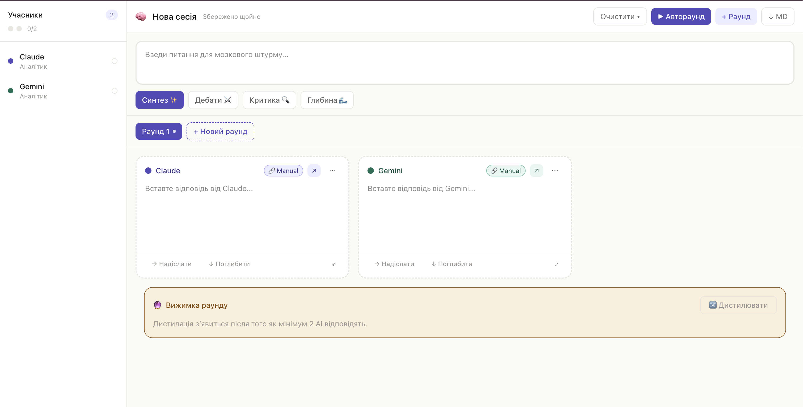

# Brainstorm Circle

Brainstorm Circle is an AI brainstorming workspace that helps teams and solo builders compare multiple model perspectives in one place.

The app combines manual chat workflows (Claude, Gemini, ChatGPT, etc.) with local Ollama automation and produces structured synthesis from round-based discussions.



## Why This Project

Most AI chats are single-threaded and hard to compare. Brainstorm Circle solves that by giving you:

- Multi-model cards in a single interface
- Round-based iteration with explicit context progression
- Cross-check summaries (agreements, conflicts, missing points)
- Automatic local synthesis with Ollama
- Persistent local session state (no DB required)

## SEO Description

Brainstorm Circle is a Next.js 16 app for multi-AI brainstorming with Ollama automation, round-by-round comparison, cross-check summaries, and Markdown export.

Primary keywords:

- multi AI brainstorming tool
- Ollama local AI orchestration
- compare ChatGPT Claude Gemini answers
- AI debate and synthesis workspace

## What Is Implemented (Current State)

- Next.js 16 App Router frontend
- Session persistence in `localStorage`
- Manual prompt flow for cloud chat tools
- Ollama-backed generation via internal API routes
- Full auto-round pipeline with partial-failure tolerance
- Auto-synthesis endpoint with model fallback
- Cross-check summary rendered in UI and included in Markdown export
- Session controls:
  - New session (full reset)
  - Clear current round
  - Keep only current round

## Architecture Highlights (After Recent Changes)

Client:

- `app/BrainstormApp.jsx`
  - Orchestrates manual flow, auto-round, auto-synthesis
  - Maintains UI state for drawers, onboarding, toast, active participant

Server routes:

- `app/api/health/ollama/route.js`
- `app/api/ai/generate/route.js`
- `app/api/brainstorm/run-round/route.js`
- `app/api/brainstorm/synthesize/route.js`

Server utilities:

- `lib/server/ollama.js`
  - Ollama health/model listing
  - model alias resolution (`llama3.1` -> installed tagged model)
  - synthesis fallback model selection

## Quick Start

```bash
npm install
npm run dev
```

Open: `http://localhost:3000`

For local automation with Ollama:

```bash
OLLAMA_ORIGINS=* ollama serve
ollama pull llama3.1
```

If your installed model has a tag (for example `llama3.1:8b`), the app now resolves common aliases automatically.

## Ideal Workflow

### 1. Define a concrete question

Good:

```text
How can we ship an MVP in 2 weeks with minimal quality risk?
```

Too broad:

```text
What do you think?
```

### 2. Pick a mode

- `Synthesis` for convergence
- `Debate` for alternative positions
- `Critique` for weak-point analysis
- `Depth` for iterative deepening

### 3. Build a participant mix

Recommended baseline:

1. 1 manual AI participant (Claude/Gemini)
2. 2 local Ollama participants

### 4. Run a round

Fast path:

1. Click `▶ Автораунд`
2. Review responses
3. Read `Cross-check summary`
4. Click `⚡ Автосинтез`

Controlled path:

1. Use manual prompts for cloud chats
2. Run local participants with `▶ Запустити`
3. Compare and synthesize

### 5. Decide next action

- If `agreements` are strong: move to implementation
- If `conflicts` are important: start a new round in Debate/Critique mode
- If `missing` points exist: ask a narrower follow-up question

### 6. Export deliverable

Use `↓ MD` to export the complete session, including cross-check blocks and synthesis.

## Session Controls

In the Header menu (`Очистити`):

- `Нова сесія` -> resets everything
- `Очистити поточний раунд` -> clears responses/synthesis/cross-check in active round
- `Видалити інші раунди` -> keeps only active round

## Project Documents

- Product vision: `BRAINSTORM_CIRCLE.md`
- MVP decisions: `MVP_DECISIONS.md`
- Detailed spec: `SPEC.md`
- Automation plan: `IMPLEMENTATION_SPEC.md`

## Project Structure

```text
app/
  BrainstormApp.jsx
  page.js
  layout.js
  globals.css
  api/
    health/ollama/route.js
    ai/generate/route.js
    brainstorm/run-round/route.js
    brainstorm/synthesize/route.js
components/
  ParticipantCard.jsx
  ParticipantPanel.jsx
  QuestionBar.jsx
  RoundTabs.jsx
  SynthesisBlock.jsx
  PromptDrawer.jsx
hooks/
  useSession.js
  useOllama.js
  useClipboardPaste.js
lib/
  promptTemplates.js
  participants.js
  storage.js
  server/ollama.js
```
